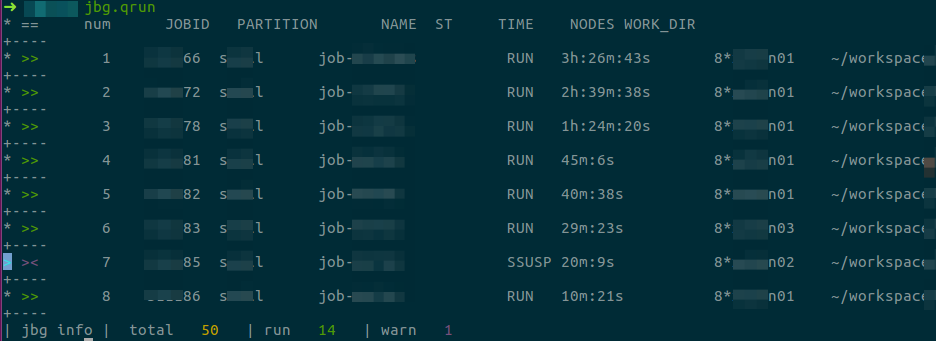
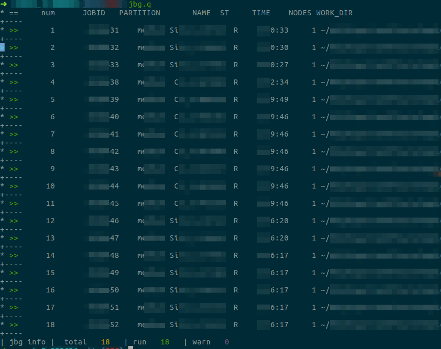
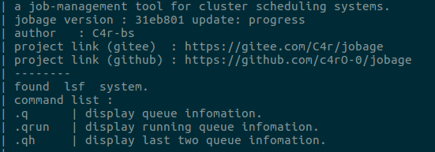
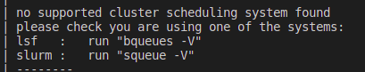

# jobage 

a job-management tool for cluster scheduling systems.
remember only one set of commands for all the systems.


author : C4r-bs

---

## view

### lsf 



### slurm




## progress 

|       | bash | zsh  |
| ----- | ---- | ---- |
| lsf   | done | done |
| slurm | done | done |
| PBS   | todo | -    |

## install

### 1. clone or download 

   **git clone :**

   ```shell
   git clone https://github.com/c4rO-0/jobage.git
   ```

   or

   ```shell
   git https://gitee.com/C4r/jobage.git
   ```

   **download:** 

   gitee : https://gitee.com/bsplu/scripts/repository/archive/master.zip

   github : https://codeload.github.com/c4rO-0/jobage/zip/refs/heads/master

### 2. start to run

**Temporarily working**

```bash
source where_is_jobage/main.sh
```
**Always working**

add `source where_is_jobage/main.sh` to `~/.bashrc`.

if `zsh` is used, add `source where_is_jobage/main.sh` to `~/.zsh`.

***Spefiy working path***

only suggested for users having single linux account

```shell
source main.sh --jbg_prefix path
```

path is the specific working path, default is `$HOME/.local/jobage`

***Debug mod***

```shell
source main.sh --jbg_debug 
```

open debug mod. more details will be printed.


### 3. test

**run**

```shell
jbg.help
```

**working** output like



**failed** output like



please make sure that one of `bqueues/squeue` can run on your system.

## usage

1. all commands run like `jbg.XXX`
2. run `jbg.help` to get a summary help information
3. run `jbg.XXX -h` get a help information for the command XXX.

### command available

| command             | behavior                        |
| ------------------- | ------------------------------- |
| jbg.q               | quary queue information         |
| jbg.qh              | quary queue history information |
| jbg.kill [num/grep] | kill job                        |
| jbg.sub             | submit job                      |
| jbg.cd              | go to the path of job           |

## custom 

1. on setting: copy setting file to jobage working directory:

``` bash
mkdir -p "$_jobage_wPath";
cp "$_jobage_default_setting" "$_jobage_setting";
source main.sh
```

2. edit setting file:
  
``` shell
vi "$_jobage_setting";
```

3. off setting (if wanted):
  
``` shell
rm "$_jobage_setting";
```

## todo list

-[x] jbg.sub

