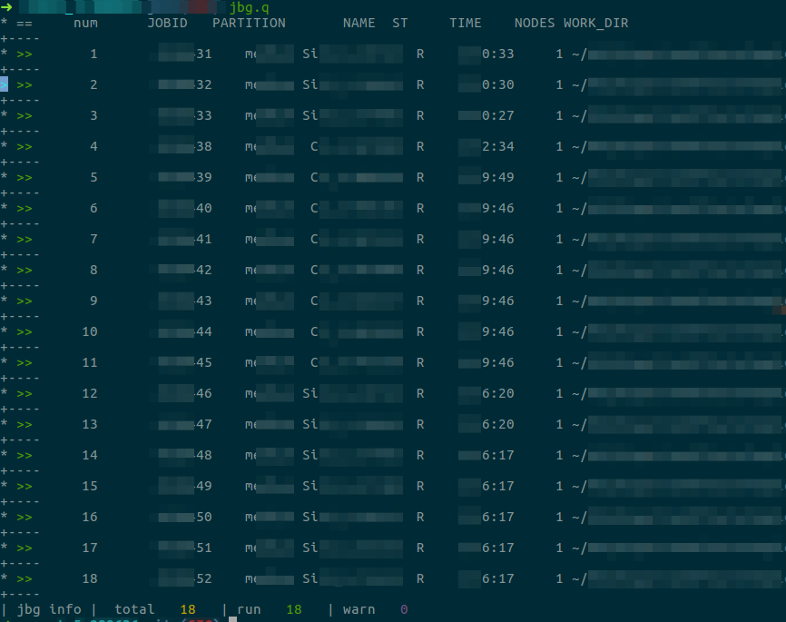

# jobage 

a job-management tool for cluster scheduling systems.
remember only one set of commands for all the systems.


author : C4r-bs

---

## view




## progress 

|       | bash | zsh   |
| ----- | ---- | ----- |
| lsf   | done | done  |
| slurm | done | debug |
| PBS   | todo | -     |


## install

```bash
source main.sh
```
or

add `source main.sh` to `~/.bashrc`

## usage

1. all commands run like `jbg.XXX`
2. run `jbg.help` to get a summary help information
3. run `jbg.XXX -h` get a help information for the command XXX.

## custom 

1. on setting: copy setting file to jobage working directory:

``` bash
mkdir -p "$_jobage_wPath";
cp "$_jobage_default_setting" "$_jobage_setting";
source main.sh
```

2. edit setting file:
  
``` shell
vi "$_jobage_setting";
```

3. off setting (if wanted):
  
``` shell
rm "$_jobage_setting";
```

## todo list

-[ ] jbg.sub

